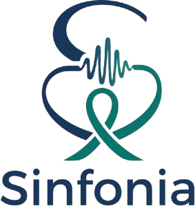

# Sinfonia – Fluxo da quimioterapia (Ideathon CBEB 2026, Desafio 1)



> **Protótipo com dados sintéticos. Não substitui decisão clínica nem o sistema Tasy.**

Organiza o dia da unidade de quimioterapia para que a bolsa esteja pronta quando o
paciente senta na poltrona, e para que o trabalho da capela da farmácia seja
distribuído ao longo do dia.

## Como rodar

```bash
python -m venv .venv
.venv\Scripts\activate          # Windows  (Linux/Mac: source .venv/bin/activate)
pip install -r requirements.txt
streamlit run app.py
```

O app abre no navegador. Ao abrir, a agenda do dia padrão é calculada
automaticamente, o que leva até 20 segundos. Não usa nenhuma API externa.

Para rodar os testes: `python -m pytest tests`

## Telas

| Aba | Para quê |
|---|---|
| 🏥 **Painel do dia** (tela inicial) | Para tablet ou TV do setor. Arraste a "hora atual" e veja as poltronas em **Grade, Lista ou Kanban**, os alertas (notificações no canto + quadro fixo + central), **registre imprevistos** (atraso, falta, bolsa atrasada, término real da infusão, mudança no horário do transporte) com o recálculo "planejado × realizado", a fila da farmácia e a situação das bolsas. |
| 📊 **Hoje x Proposta** | Remarcações em destaque, indicadores lado a lado com a variação em %, gráficos por hora e a comparação da simulação com os números reais. |
| 💚 **O que melhorou** | Dashboard do ganho para o paciente: horas a menos na unidade, histórias de pacientes fictícios ("PAC-069: 5h42 → 1h06"), antes e depois paciente a paciente, ganho por tipo de tratamento, para onde vai o tempo, **meta de espera** e **ociosidade** (poltronas livres, poltronas ocupadas sem tratar e capela parada). |
| 📅 **Agenda do dia** | Gantt das poltronas e da capela, tabela de horários e exportação em CSV. |
| ⚙️ **Premissas** | Edição de todos os valores de entrada e geração de um novo dia sintético. |

## Módulos

| Arquivo | Conteúdo |
|---|---|
| `dados.py` | Premissas, tabela de protocolos e gerador do dia sintético (PAC-001, PAC-002...) |
| `data/horarios_limite.csv` | Horário limite e cor de cada protocolo (folha do setor) |
| `simulacao_atual.py` | Simulação de eventos discretos do funcionamento atual (filas por ordem de chegada) |
| `otimizador.py` | Modelo CP-SAT (OR-Tools) da agenda otimizada |
| `indicadores.py` | Cálculo dos indicadores e das séries por hora |
| `ganhos.py` | Ganho por paciente (tempo na unidade hoje × proposta), meta de espera |
| `painel.py` (Kanban) | Colunas, prioridade e selos de risco do Kanban do fluxo |
| `ocorrencias.py` | Imprevistos registrados e recálculo do dia realizado (efeito em cascata) |
| `img/` | Logo e símbolo do Sinfonia |
| `painel.py` | Estado da unidade em uma hora qualquer (poltronas, bolsas, fila, alertas) |
| `ui_componentes.py` / `app.py` | Interface acessível em Streamlit |

## Premissas usadas (todas são suposições a validar com o hospital)

| Premissa | Valor padrão |
|---|---|
| Turno | 7h às 18h |
| Poltronas | 40 |
| Capela | 3 bolsas manipuladas ao mesmo tempo |
| Pacientes no dia | 90 (57% chegam antes das 10h no cenário atual) |
| Alta após o fim da infusão | 15 min hoje · 5 min com alta antecipada (proposta) |
| Transporte da bolsa | 5 min |
| Acomodação (proposta) | o paciente senta 10 min antes da bolsa chegar |
| Folga antes do horário limite (proposta) | 30 min |
| Sexta-feira | desmarcada (quando marcada, todos os limites ficam 1h mais cedo) |
| Meta de espera na poltrona | 30 min |
| Pacientes do interior | 40% do dia; transporte chega entre 6h30 e 7h30 e volta entre 15h00 e 16h30 |
| Folga antes do retorno do transporte (proposta) | 30 min |
| Espera máxima do interior até sentar (proposta) | 120 min (da chegada do transporte) |

### Tipos de tratamento (cores da folha do setor)

| Tipo de tratamento | Cor na folha | Preparo (min) | Infusão (min) | Parte dos pacientes |
|---|---|---|---|---|
| Longo | 🔴 vermelho | 15 | 240 | 15% |
| Intermediário laranja *(a confirmar)* | 🟠 laranja | 12 | 120 | 15% |
| Intermediário marrom *(a confirmar)* | 🟤 marrom | 12 | 120 | 15% |
| Rápido | 🟢 verde | 9 | 51 | 35% |
| Injetável | 🔵 azul | 6 | 15 | 20% |

- **Laranja e marrom:** ficam como grupos separados, com o mesmo tempo, até o setor
  confirmar se são o mesmo nível.
- **Mix e protocolo:** cada paciente sintético sorteia o grupo pelo mix. Dentro do grupo,
  sorteia um protocolo da tabela do setor, com a mesma chance para todos.
- **Acessibilidade das cores:** vermelho e verde se confundem para daltônicos. Por isso a
  cor nunca aparece sozinha: o nome vai sempre escrito e cada grupo tem uma hachura
  própria nos gráficos.

**Regra do evento:** os tempos de preparo e de infusão são **parâmetros informados
pelo hospital**. O sistema só os usa para agendar e nunca os calcula nem altera.
Nenhuma decisão clínica é tomada.

### Horário limite dos protocolos
`data/horarios_limite.csv` reproduz a folha fixada na unidade de QT. É dado do setor, não
de paciente. Para cada um dos 34 protocolos, a folha traz o **horário limite** para o
paciente estar na triagem com o farmacêutico e a **cor** que classifica o tempo de
infusão.

- **Depois do limite:** não dá mais para manipular a bolsa no dia, e o paciente é
  **remarcado** para outro dia.
- **Às sextas-feiras:** todos os limites têm 1h a menos, por causa do encerramento do
  setor.

### Cenário atual (simulação)
- **Remarcação:** o paciente que chega à triagem depois do horário limite do protocolo é
  remarcado. Ele não ocupa poltrona nem capela.
- **Poltrona:** os demais sentam ao chegar. Se não houver poltrona livre, esperam na
  recepção.
- **Capela:** é uma fila única, na ordem em que as prescrições são liberadas.
- **Liberação das prescrições (calibração por grupo):**
  - nos grupos planejados (longo e intermediários), 90% das prescrições são liberadas
    antes da chegada;
  - nos curtos (rápido e injetável), só 20% são liberadas antes. As demais saem cerca de
    10 min depois da chegada, com variação.
- **Remarcações:** a quantidade é **estimada pela simulação**, porque não há dado real.
- **Dia padrão (semente 56):**

| Número | Real | Simulado |
|---|---|---|
| Espera na poltrona (mediana) | 13 min | 12,6 min |
| Esperam mais de 30 min | 21% | 24% |
| Esperam mais de 1h | 9% | 10% |
| Horas de poltrona sem tratamento | ~54 h | 54,8 h |
| Maior número de pacientes ao mesmo tempo | 49 | 44 |
| Espera média – Rápido | 43 min | 39 min |
| Espera média – Injetável | 47 min | 28 min |
| Remarcados por perder o horário limite | sem dado | 2 |

- **Pico de pacientes:** fica abaixo do real porque o protótipo usa 40 poltronas.
  Confirmar esse número com o hospital.
- **Esperas por grupo:** as do Painel de Indicadores (43 e 47 min) não cabem junto com os
  números gerais. Se Rápido e Injetável esperassem isso, as horas sem tratamento
  passariam de 54 h. Confirmar se esses tempos incluem a espera na recepção.

### Proposta (CP-SAT)
- **Variável de decisão:** o início da infusão de cada paciente, em slots de 10 min.
- **Restrições:**
  - o preparo na capela respeita a capacidade da capela (restrição cumulativa);
  - a poltrona (acomodação + infusão + alta) respeita o número de poltronas (restrição cumulativa);
  - a infusão só começa depois que a bolsa foi preparada e transportada;
  - o paciente chega à triagem **pelo menos 30 min antes do horário limite** do protocolo
    (folga editável), o que dá **zero remarcações por prazo**;
  - tudo acontece dentro do turno.
- **Objetivo, em ordem de peso:**
  1. atender todos os pacientes do dia (maximizar as horas de quimioterapia no turno);
  2. suavizar a carga da capela (menor pico de preparo por hora);
  3. minimizar a espera na poltrona;
  4. minimizar o tempo em que a bolsa pronta fica parada.
- **Limite de tempo:** 20 s. O solver para antes quando a solução está a menos de 2%
  da melhor possível, e o status aparece na tela.
- **Hipóteses da proposta:**
  - a prescrição é liberada com antecedência (agendamento prévio);
  - a alta é preparada antes do fim da infusão.
- **Reprodutibilidade:** o solver usa várias linhas de execução em paralelo, então
  duas execuções podem gerar agendas um pouco diferentes, com a mesma qualidade.

### Pacientes do interior 🚐
- Vêm no **transporte da prefeitura**: chegam cedo e voltam num horário fixo. Perder o
  transporte ou ser remarcado custa a viagem inteira.
- **Hoje (simulação):** chegam cedo, mas são atendidos na vez deles; quem só libera a
  poltrona depois do retorno **perde o transporte** (no dia padrão: 2 pacientes).
- **Proposta:** a chegada é a do transporte (não se marca outro horário) e a poltrona tem
  que liberar **pelo menos 30 min antes do retorno** (regra obrigatória). O tempo deles na
  unidade entra no objetivo com peso menor que o de remarcar, para a prioridade não tirar
  a vaga de ninguém.
- **Espera máxima até sentar:** da chegada do transporte até a poltrona, no máximo 120 min
  (editável). Sem essa regra, o otimizador deixava alguns pacientes até 4 h na recepção
  para equilibrar a capela.
- **Troca:** com a capela de 3 postos não dá para preparar todas as bolsas do interior às
  7h. Quanto menor a espera máxima, mais lotada fica a capela de manhã (90 min: capela
  quase lotada; 120 min: pico ~165 min/h; 150 min: pico ~135 min/h). A média do interior
  fica em ~3h (hoje ~5h) e alguns que hoje seriam atendidos logo cedo esperam até ~1h a
  mais.
- O tempo do interior conta **desde a chegada do transporte** nos dois cenários.

### Kanban do fluxo
- Cada cartão é um paciente; as colunas são as etapas: Agendado → Chegou → Na poltrona
  (aguardando a bolsa) → Em infusão → Em alta → Concluído. Remarcados e faltas ficam à parte.
- No topo, os **limites**: poltronas ocupadas (de 40) e capela preparando (de 3); ficam
  vermelhos quando enchem.
- Dentro da coluna vêm primeiro os cartões **⛔ em risco** (vai perder o transporte ou o
  horário limite, espera longa), depois **⚠️ atenção**; sem selo = no prazo.

### Alertas
- Quando um alerta **começa**, aparece uma notificação no canto superior direito (o de
  remarcado e o de transporte ficam até serem fechados); se ele acabar e voltar, aparece
  de novo.
- Os alertas ativos ficam no **quadro fixo do canto inferior direito** e todos, com o texto
  completo, na **Central de alertas**.
- Tipos: espera acima de 30 min, 🚐 transporte do interior em risco/perdido, perto do
  horário limite, remarcado e preparar a alta.

### Imprevistos (Painel do dia)
- A equipe registra **o que aconteceu**: atraso do paciente (hora real de chegada), falta,
  atraso da bolsa (minutos), hora real de término da infusão informada pela enfermagem ou
  novo horário de volta do transporte do interior.
- O dia é **recalculado sem replanejar**: cada paciente continua na poltrona planejada; se o
  anterior sair mais tarde, o próximo espera (efeito em cascata). Quem chegar depois do
  horário limite do protocolo vira remarcado.
- A tela mostra "planejado × realizado" e avisa quando a poltrona passa do fim do turno.
- É só registro: o sistema não toma nenhuma decisão clínica.

### Resultado no dia padrão

| Indicador | Hoje | Proposta |
|---|---|---|
| Remarcados por perder o horário limite | 2 | 0 |
| Pacientes do interior que perdem o transporte | 2 | 0 |
| Pacientes atendidos no dia | 88 | 90 |
| Horas de quimioterapia no turno | 132,8 h | 140,8 h |
| Horas de poltrona sem tratamento | 54,8 h | 22,5 h |
| Esperam mais de 30 min | 24% | 0% |
| Pico de pacientes na unidade | 44 | 24 |
| Ocupação da capela manhã / tarde | 75% / 9% | 48% / 45% |

# edeathon
